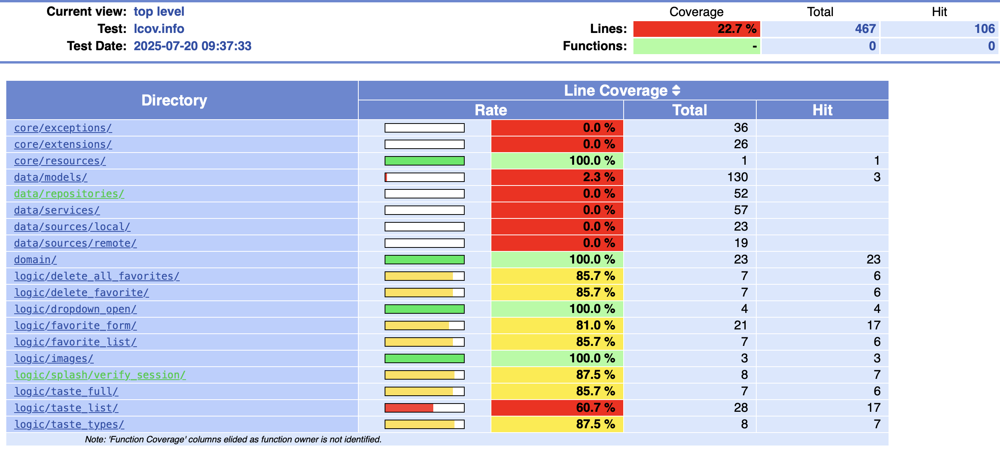
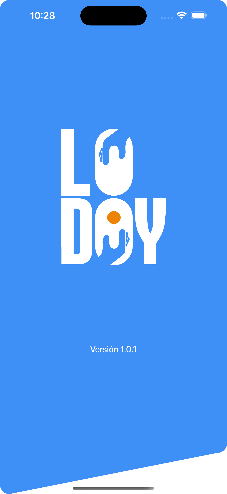
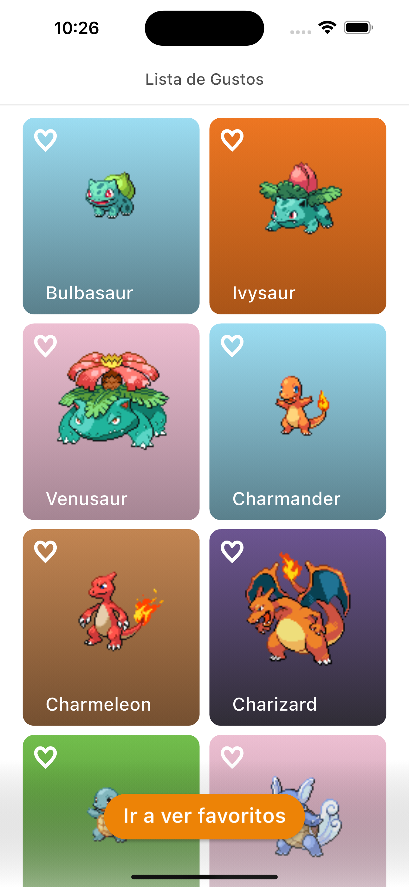
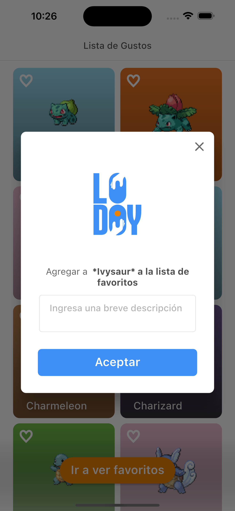
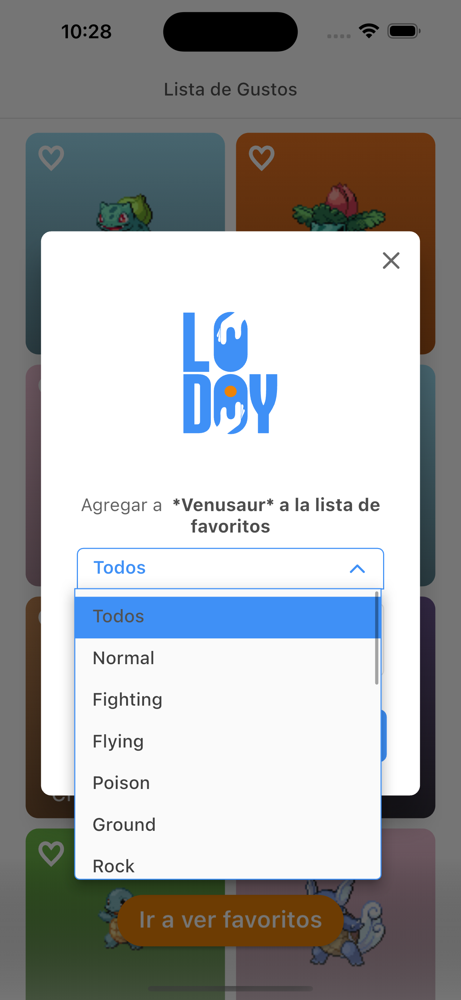
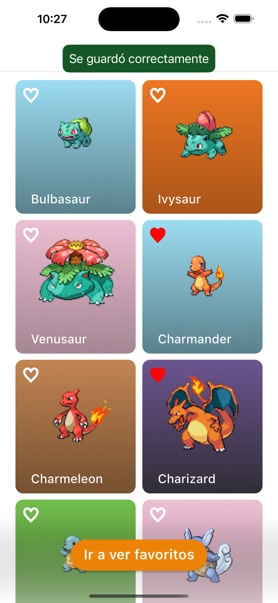
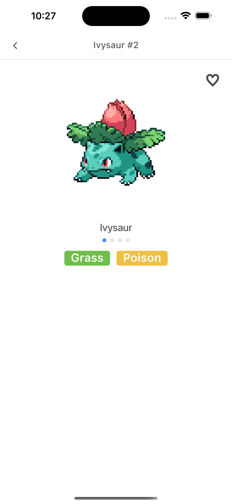
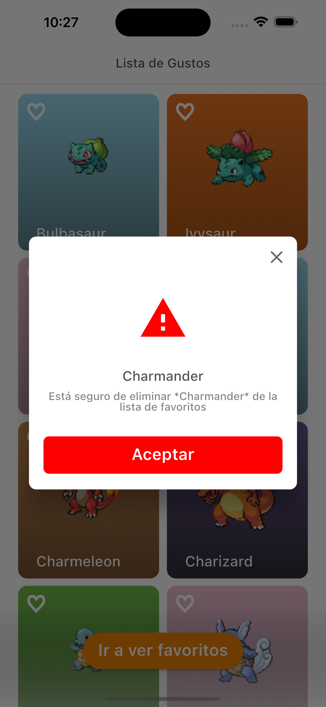
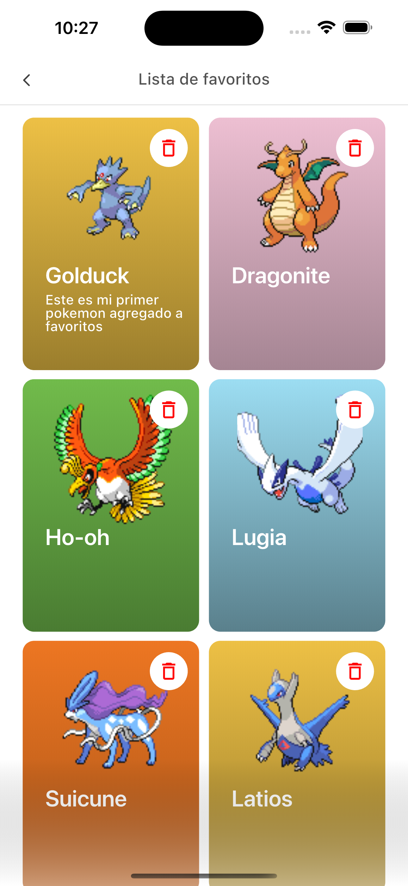

# GustoMaster App 🍽️

Aplicación Flutter desarrollada con Clean Architecture, BLoC/Cubit, y buenas prácticas de desarrollo. Permite explorar gustos, favoritos, y más.

## 🛠️ Configuración inicial

1. Clona el repositorio:
   ```bash
   git clone https://github.com/JosephLugoGPDS/gusto-app.git
   cd app
   ```
2. Instala las dependencias:

   ```bash
        flutter pub get
        Versión
        Flutter 3.29.3 • channel stable • https://github.com/flutter/flutter.git
        Framework • revision ea121f8859 (3 months ago) • 2025-04-11 19:10:07 +0000
        Engine • revision cf56914b32
        Tools • Dart 3.7.2 • DevTools 2.42.3
   ```

3. Configura el entorno:
   ```bash
       En lib/app/api_dev.dart: configuración para entorno de desarrollo.
       En lib/app/api_prod.dart: configuración para entorno de producción.
       No se usan flavors nativos. Solo se elige el archivo de entrada para
   ```
4. lanzar:

   ```bash
       flutter run -t lib/main.dart
   ```

5. 🚀 Estructura del proyecto

   ```bash
       lib/
       ├── app/ # Configuración general y APIs por entorno
       ├── core/ # Recursos compartidos (constantes, estilos, helpers)
       ├── data/ # Modelos remotos/locales, fuentes de datos
       ├── domain/ # Entidades y casos de uso
       ├── logic/ # Cubits (BLOC) organizados por funcionalidad
       ├── presentation/ # UI (pantallas y widgets)
       ├── main.dart # Punto de entrada principal
       test/ # Pruebas unitarias por módulo
   ```

6. 🧪 Pruebas

   - Ejecutar todos los tests

   ```bash
       flutter test
   ```

   - Ejecutar tests con cobertura

   ```bash
       flutter test --coverage
   ```

7. 📱 Capturas de pantalla
   ```bash
       
       
       
       
       
       
       
       
       
       
   ```
8. ✅ Requisitos funcionales aplicados

   ```bash

       1. Clean Code & buenas prácticas
           ✅ Nombres descriptivos, funciones breves, sin duplicación
           ✅ Null-safety en todo el código
       2. Gestión de estado con Cubit
           ✅ ApiCubit: obtención de lista desde PokéAPI o Dog API
           ✅ PreferenceCubit: CRUD de gustos
           ✅ Tests unitarios para cada Cubit
       3. Persistencia local
           ✅ Hive o Isar como solución local (Se uso shared preferences)
           ✅ Modelos y adaptadores definidos
           ✅ CRUD persistente y fiable
       4. Consumo de API pública
           ✅ PokéAPI o The Dog API
           ✅ Mapeo de JSON a modelos
           ✅ Estados: loading, success, error
           ✅ Indicador de carga y manejo de errores
       5. Responsive UI
           ✅ Adaptación a distintos tamaños de pantalla (mobile/tablet)
           ✅ Uso de flutter_screenutil
       6. Navegación
           ✅ Rutas nombradas:
           ✅ Uso de Fluro como router
       7. Simetría en UI
           ✅ Márgenes, paddings y tamaños consistentes
       8. Documentación mínima
           ✅ README detallado
           ✅ Comentarios en el código clave
       9. Pruebas
           ✅ Tests unitarios para Cubits
           ✅ Tests unitarios para usecases
           ✅ Cobertura: 25%
   ```

9. 🖥️ Pantallas mínimas requeridas
   ```bash
       ✅ Listado de ítems API (/api-list)
       ✅ ListView de Pokémon o razas
       ✅ Spinner mientras carga
       ✅ Mensaje de error + botón "Reintentar"
       ✅ Crear nuevo gusto (/prefs/new)
       ✅ Selector (dropdown o grid)
       ✅ Campo para nombre personalizado
       ✅ Botones "Guardar" y "Cancelar"
       ✅ Lista de gustos (/prefs)
       ✅ ListView con nombre e ícono (Se uso slivers)
       ✅ Swipe o ícono para eliminar
       ✅ Detalle de gusto (/prefs/:id)
       ✅ Nombre personalizado, imagen, datos del API
       ✅ Botón "Eliminar" y "Volver"
       ✅ Pantalla de carga global
       ✅ CircularProgressIndicator centrado
       ✅ Pantalla de error global
       ✅ Mensaje amigable y botón de reintento
   ```
